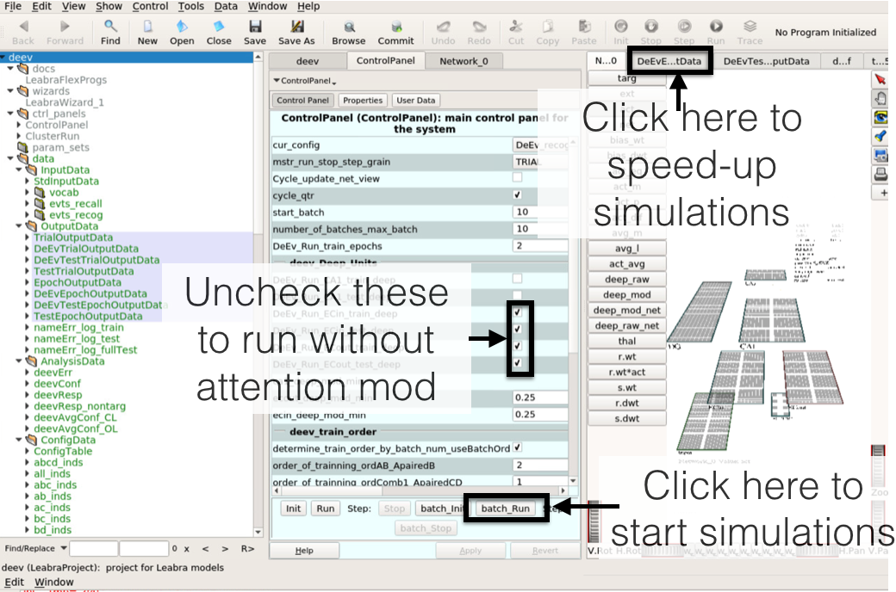

## Instructions for running Dependent Event simulations


### Installation

 We have supplied a Dockerfile (and publicly available image) and docker-compose.yml to instantiate a version of Emergent that was used to generate the results in the manuscript.  Once the repository is checked out, you can build the image yourself using
 ```
 docker build -t nickketz/emergent:8.0 .
 ```
 or you can pull it from docker hub:
 ```
 docker pull nickketz/emergent.8.0
 ```
 Then you can run the image using:
 ```
 docker-compose up -d
 ```
This will startup a docker container running Ubuntu 16.04 with Emergent 8.0 installed.  There is a password-less VNC server running on startup that should now be accessible on port 5900 on your localhost.  You can view it using any standard VNC clients, I've had good luck on MacOS with [TigerVNC](https://tigervnc.org/).  To connect simply point the VNC client to `localhost:5900`.

**Note:** if you already have something bound to port 5900, you can change the VNC port by modifying the `docker-compose.yml` line 7. For example if you want to access the VNC server on port 5910 adjust your `docker-compose.yml` line 7 to look like:
```
  - 5910:5900
```


### Running simulations

Once on the VNC server you should see a open terminal.  To start Emergent and load the model type:
```
emergent /deev/projs/deev.proj
```
This should open a display similar to this:



 The middle panel, referred to as the `ControlPanel`, has a button labeled `batch_run`.  Click this to start the simulations.  You should see the network activations changing on the far right.  To speed up simulations you can change the visualizer panel away the network view by clicking on one of the other tabs in the far right panel

Once complete you should see logs generated in the `projs` folder:
```
==> tree projs/
projs/
├── deev.proj
└── logs_DeEv_recog_0.25ECdeep_0CA1deep_2trainepochs
    ├── deev_36events_Sub0.txt
    ├── deev_36events_Sub1.txt
	...
    ├── deev_36events_Sub7.txt
    ├── deev_nontarg_36events_Sub0.txt
	...
    └── deev_nontarg_36events_Sub7.txt
```

You can also run the same simulations without the thalamic attentional mechanisms by deselecting the boxes on the `ControlPanel` labeled `DeEv_Run_EC*`, highlighted in the picture above.  The click the `batch_init` followed by the `batch_run` buttons on the `ControlPanel` to start simulations.  This should generate logs with the folder named `logs_DeEv_recog_0ECdeep_0CA1deep_2trainepochs`.

### Analyzing the data

Once the logs have been generated you can now run the matlab analysis scripts located in the `matlab` folder.  Start matlab and go to the `matlab` folder.  Then run the analysis script
```
deev_analysis.m
```

This should generate 7 plots, some of them were unused in the publication.


To point the analysis to newly generated data you can uncomment line 7, and comment out line 9:
```
% generated data
cfg.dir = '../projs/logs_DeEv_recog_0.25ECdeep_0CA1deep_2trainepochs';
% publication data
% cfg.dir = '../projs/pub_logs/logs_attn';
```

Then re-run the `deev_analysis.m` script to regenerate the plots using the new data


To plot results comparing simulations run with attentional mechanism to those without, you can run
```
aug_v_null.m
```
This will generate the plots comparing performance in the augmented model with attentional modulation with the original Theta-Phase model.


Similyar, to plot these comparisons using newly generated data modify `aug_v_null.m` as follows:
```
%generated logs
dirs = {
    '../projs/logs_DeEv_recog_0.25ECdeep_0CA1deep_2trainepochs',
    '../projs/logs_DeEv_recog_0ECdeep_0CA1deep_2trainepochs'
    };

%publication logs
% dirs = {
%     '../projs/pub_logs/logs_attn',
%     '../projs/pub_logs/logs_null',
%     };
```

Note, the generated results may vary from those in the publication due to changes in the random initializations.
